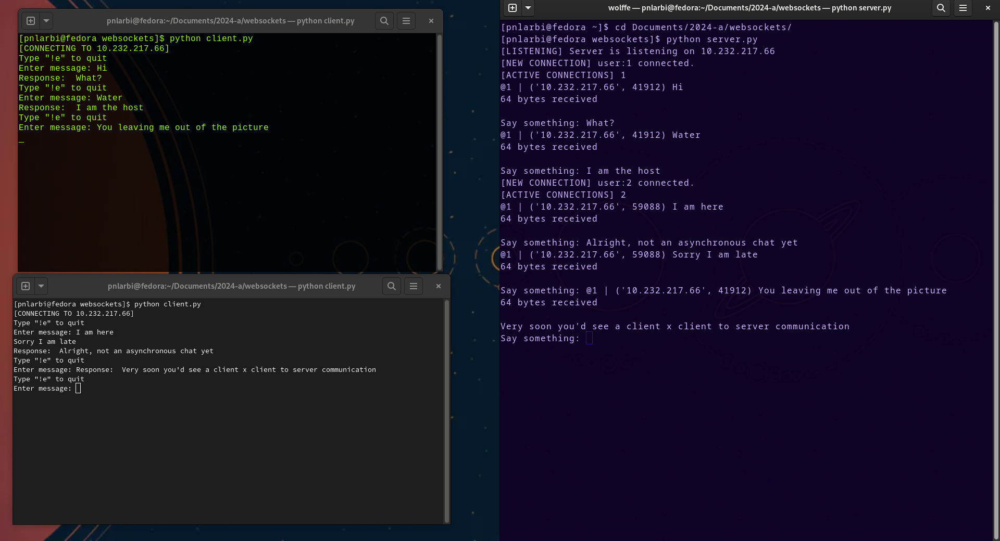

# WebSockets Chat Demo

This is a simple demonstration of a chat application using WebSockets. It allows users to send and receive messages in real-time over a terminal.

## Appearance


The image above shows the interface of the chat application. It's a simple terminal-based interface where users can type their messages and see responses in real-time.

The chat is client to server for this repo

## Installation

I. To install this project, follow these steps:

    1. Ensure you have Python installed on your system. If not, download and install it from [here](https://www.python.org/downloads/).

    2. Install pip if it's not already installed. You can do this by running the following command:
        ```
        python get-pip.py
        ```

    3. Install virtualenv by running:
        ```
        pip install virtualenv
        ```

    4. Create a virtual environment in the project directory:
        ```
        virtualenv venv
        ```

    5. Activate the virtual environment:
        - On Windows, run:
            ```
            venv\Scripts\activate
            ```
        - On Unix or MacOS, run:
            ```
            source venv/bin/activate
            ```

II. Clone the repository:
    ```
    git clone https://github.com/phidlarkson/websockets-for-beginners.git
    ```

III. Navigate into the project directory:
    ```
    cd websockets-for-beginners
    ```

IV. Install the dependencies:
    ```
    python install -r requirements
    ```

## Usage

1. Start the server:
    ```
    python server.py
    ```

2. Open another terminal and start the client:
    ```
    python client.py
    ```

3. You can now start chatting by typing messages into the client terminal.

## Contributing

Pull requests are welcome. For major changes, please open an issue first to discuss what you would like to change.

## License

[MIT](https://choosealicense.com/licenses/mit/)